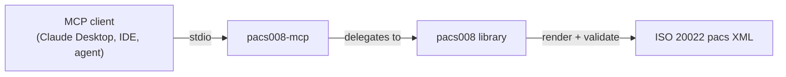

# pacs008-mcp: An MCP Server for ISO 20022 FI-to-FI Credit Transfers

![pacs008-mcp banner][banner]

[![PyPI Version][pypi-badge]][07]
[![Python Versions][python-versions-badge]][07]
[![PyPI Downloads][pypi-downloads-badge]][07]
[![Licence][licence-badge]][01]
[![Tests][tests-badge]][tests-url]
[![Quality][quality-badge]][quality-url]
[![Documentation][docs-badge]][docs-url]

**A [Model Context Protocol][mcp] server that exposes the [`pacs008`][core]
ISO 20022 FI-to-FI Customer Credit Transfer library as tools for AI agents and
assistants** — discover message types and scheme profiles, validate records
against the JSON Schema and against a rail's usage guidelines, generate
validated XML, validate raw XML against the bundled XSD, and parse inbound
messages, all from your favourite MCP client.

> **Latest release: v0.0.5** — 15 MCP tools over stdio, all backed by the
> `pacs008` library, for Python 3.10+. Adds `convert_mt103`, the legacy SWIFT
> MT103 → pacs.008 (MT→MX) migration path.

## Contents

- [Overview](#overview)
- [Install](#install)
- [Quick Start](#quick-start)
- [Tools](#tools)
- [November 2026 structured-address cliff](#november-2026-structured-address-cliff)
- [Using the tools](#using-the-tools)
- [Development](#development)
- [Licence](#licence)
- [Contribution](#contribution)
- [Acknowledgements](#acknowledgements)

## Overview

The [Model Context Protocol][mcp] (MCP) is an open standard that lets AI agents
and assistants discover and call external tools in a uniform way. **pacs008-mcp**
is an MCP server that turns the [`pacs008`][core] library into a set of
first-class agent tools, so an assistant can generate, validate, and parse
**ISO 20022 `pacs.008` FI-to-FI Customer Credit Transfer XML messages** — and
the related pacs.002/.004 status and return messages — directly from a
conversation.

Every tool is a thin, typed wrapper over the `pacs008` library — the same
package used by the CLI and REST API — so all interfaces behave identically.
Tools return JSON-serialisable data; on a validation error they return an
`{"error": ...}` payload rather than raising.

- **Website:** <https://pacs008.com>
- **Source code:** <https://github.com/sebastienrousseau/pacs008-mcp>
- **Bug reports:** <https://github.com/sebastienrousseau/pacs008-mcp/issues>



## Install

**pacs008-mcp** runs on macOS, Linux, and Windows and requires **Python 3.10+**
and **pip**. It pulls in the core `pacs008` library and the MCP SDK
automatically.

```sh
python -m pip install pacs008-mcp
```

> **Note:** while the core `pacs008` library is not yet on PyPI, install it from
> source first:
>
> ```sh
> python -m pip install "git+https://github.com/sebastienrousseau/pacs008.git"
> python -m pip install pacs008-mcp
> ```

## Quick Start

Launch the server over stdio (the FastMCP default transport):

```sh
pacs008-mcp
```

Register it with any MCP client (e.g. Claude Desktop) by adding it to the
client's configuration:

```json
{
  "mcpServers": {
    "pacs008": { "command": "pacs008-mcp" }
  }
}
```

## Tools

All tools wrap the `pacs008` library, so they behave identically to the CLI and
REST API.

- `list_message_types` — List the 20 supported ISO 20022 pacs message types
- `list_schemes` — List the registered scheme / usage-guideline profiles
- `get_scheme` — Inspect a scheme profile's rules
- `get_required_fields` — Required input fields for a message type
- `get_input_schema` — Full input JSON Schema for a message type
- `validate_records` — Validate flat records against a message type's schema
- `validate_scheme` — Validate records against a scheme's usage guidelines
- `generate_message` — Generate a validated pacs XML message
- `validate_xml` — Validate a raw XML string against the bundled XSD
- `parse_message` — Parse & classify an inbound ISO 20022 message
- `convert_mt103` — Convert a legacy SWIFT MT103 into pacs.008-ready records (MT→MX migration)
- `classify_address` — Classify a postal address as structured / hybrid / unstructured
- `validate_address` — Validate one postal address against an address policy
- `repair_address` — Upgrade legacy unstructured address lines toward hybrid/structured form
- `validate_addresses` — Batch-validate every party address across payment rows

## November 2026 structured-address cliff

On **14 November 2026**, fully unstructured postal addresses are decommissioned
across SWIFT CBPR+, HVPS+, TARGET2 RTGS, CHAPS, Fedwire and Lynx — after that
date, any cross-border or high-value payment carrying an unstructured-only
postal address is **rejected at the rail**. The four address tools above wrap
the `pacs008` library's `standards.address` module so an agent can get ahead of
the deadline: `classify_address` shows where an address stands, `validate_address`
/ `validate_addresses` enforce a policy (defaulting to the cliff rule
`hybrid_or_structured`, which rejects unstructured addresses), and
`repair_address` runs country-aware heuristics (`GB`, `US`, `DE`, `FR`, `JP`,
plus a best-effort fallback) to lift legacy address lines into hybrid form.
The repair step is experimental — audit its output before submitting downstream.

## Using the tools

You can invoke the tools in-process — without a transport — straight through the
FastMCP instance. This mirrors what an agent receives over stdio. The runnable
version of this snippet lives in [`examples/mcp_tools.py`](examples/mcp_tools.py).

```python
import asyncio

from pacs008_mcp.server import server

record = [
    {
        "msg_id": "MSG001",
        "creation_date_time": "2026-01-15T10:30:00",
        "nb_of_txs": "1",
        "settlement_method": "CLRG",
        "interbank_settlement_date": "2026-01-15",
        "end_to_end_id": "E2E001",
        "interbank_settlement_amount": "1000.00",
        "interbank_settlement_currency": "EUR",
        "charge_bearer": "SHAR",
        "debtor_name": "Debtor Corp",
        "debtor_agent_bic": "DEUTDEFF",
        "creditor_agent_bic": "COBADEFF",
        "creditor_name": "Creditor Ltd",
    }
]


async def main() -> None:
    async def call(name, args):
        result = await server.call_tool(name, args)
        content = result[0] if isinstance(result, tuple) else result
        return content[0].text if content else ""

    print(await call("list_schemes", {}))
    xml = await call("generate_message",
                     {"message_type": "pacs.008.001.08", "records": record})
    print(xml[:46])  # -> <?xml version="1.0" encoding="UTF-8"?> ...


asyncio.run(main())
```

Run it directly:

```sh
python examples/mcp_tools.py
```

## Development

**pacs008-mcp** uses [Poetry](https://python-poetry.org/) and
[mise](https://mise.jdx.dev/).

```bash
git clone https://github.com/sebastienrousseau/pacs008-mcp.git && cd pacs008-mcp
mise install
poetry install
poetry shell
```

> This package depends on the core `pacs008` library. Until it is on PyPI,
> install it from source first:
> `pip install "git+https://github.com/sebastienrousseau/pacs008.git"`.

A `Makefile` orchestrates the quality gates (kept in lockstep with CI):

```bash
make check        # all gates (REQUIRED before commit)
make test         # pytest
make lint         # ruff + black
make type-check   # mypy --strict
```

---

## Related MCP Servers

Part of the **ISO 20022 MCP Suite** — open-source, Apache-2.0 licensed MCP servers for banking and financial-services AI agents:

| Server | Purpose |
|---|---|
| [`pain001-mcp`](https://github.com/sebastienrousseau/pain001-mcp) | Generate & validate ISO 20022 pain.001 payment files (v03–v12, pain.008, SEPA) with rulebook checks |
| [`camt053-mcp`](https://github.com/sebastienrousseau/camt053-mcp) | Parse & reconcile ISO 20022 camt.053 bank-to-customer statements — CBPR+/HVPS+ ready |
| [`acmt001-mcp`](https://github.com/sebastienrousseau/acmt001-mcp) | Generate & validate ISO 20022 acmt account-management messages |
| [`bankstatementparser-mcp`](https://github.com/sebastienrousseau/bankstatementparser-mcp) | Parse bank statements (BAI2, MT940/MT942, CAMT.053, OFX, CSV) into structured transactions |
| [`noyalib-mcp`](https://github.com/sebastienrousseau/noyalib) | Lossless YAML 1.2 parsing, formatting & validation (Rust, 100% spec compliance) |

---

## MCP Registry

`mcp-name: io.github.sebastienrousseau/pacs008-mcp`

---

## Licence

Licensed under the [Apache Licence, Version 2.0][01]. Any contribution submitted
for inclusion shall be licensed as above, without additional terms.

## Contribution

Contributions are welcome — see the [contributing instructions][04]. Thanks to
all [contributors][05].

## Acknowledgements

Built on the [`pacs008`][core] ISO 20022 FI-to-FI Customer Credit Transfer
library and the [Model Context Protocol][mcp] Python SDK.

[01]: https://opensource.org/license/apache-2-0/
[04]: https://github.com/sebastienrousseau/pacs008-mcp/blob/main/CONTRIBUTING.md
[05]: https://github.com/sebastienrousseau/pacs008-mcp/graphs/contributors
[07]: https://pypi.org/project/pacs008-mcp/
[core]: https://github.com/sebastienrousseau/pacs008
[mcp]: https://modelcontextprotocol.io
[banner]: https://kura.pro/pacs008-mcp/images/banners/banner-pacs008-mcp.svg 'pacs008-mcp'
[docs-badge]: https://img.shields.io/badge/Docs-pacs008.com-blue?style=for-the-badge
[docs-url]: https://pacs008.com/
[licence-badge]: https://img.shields.io/pypi/l/pacs008-mcp?style=for-the-badge
[pypi-badge]: https://img.shields.io/pypi/v/pacs008-mcp?style=for-the-badge
[pypi-downloads-badge]: https://img.shields.io/pypi/dm/pacs008-mcp.svg?style=for-the-badge
[python-versions-badge]: https://img.shields.io/pypi/pyversions/pacs008-mcp.svg?style=for-the-badge
[quality-badge]: https://img.shields.io/github/actions/workflow/status/sebastienrousseau/pacs008-mcp/ci.yml?branch=main&label=Quality&style=for-the-badge
[quality-url]: https://github.com/sebastienrousseau/pacs008-mcp/actions/workflows/ci.yml
[tests-badge]: https://img.shields.io/github/actions/workflow/status/sebastienrousseau/pacs008-mcp/ci.yml?branch=main&label=Tests&style=for-the-badge
[tests-url]: https://github.com/sebastienrousseau/pacs008-mcp/actions/workflows/ci.yml
